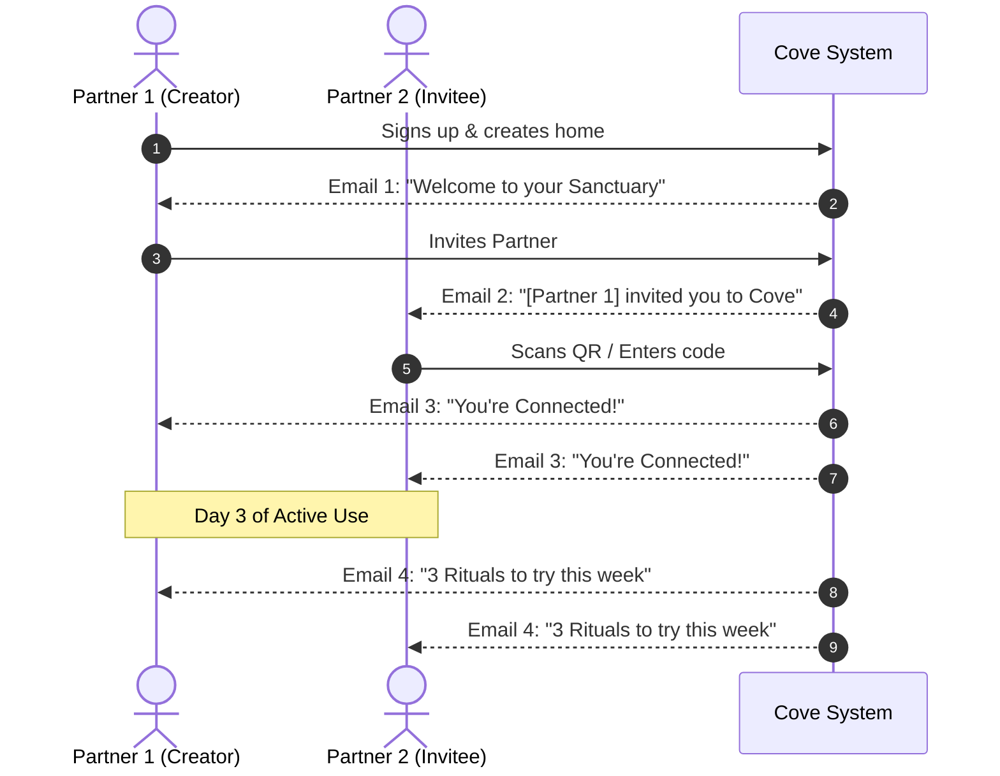

# Cove: The Go-To-Market (GTM) & Launch Readiness Masterplan

A complete, end-to-end blueprint covering every touchpoint needed before, during, and after launching **Cove**—from first-time user experience and store listings to social media engine, lifecycle emails, and compliance.

---

## 1. The Pre-Launch Waitlist & Viral Early Access Engine ("Phase 0")

Launching directly into app stores without a pre-built audience is the single biggest cause of consumer app stagnation. A focused pre-launch waitlist serves three critical business goals:
1. **Validates Market Demand & Positioning**: Tests which emotional hook (quiet luxury, split finances, shared routines, E2E privacy) generates the highest conversion before spending time on paid promotion.
2. **Solves the Google Play 20-Tester Hurdle**: Google Play Console mandates that personal developer accounts recruit **20 testers opted in for 14 consecutive days** before production release. An engaged waitlist turns this hurdle into a VIP "Founding Couples Beta".
3. **Owned Distribution**: Social media algorithms fluctuate constantly. An email list is an owned, direct line to high-intent couples.

---

### A. The High-Converting Waitlist Landing Page (`cove.app`)

A minimalist, high-aesthetic single-page destination built on Cloudflare Pages or Vercel:

* **Hero Section**:
  * *Badge*: `🌿 Now accepting Founding Couples for Private Access`
  * *Headline*: *"A quiet sanctuary for just the two of you."*
  * *Subheadline*: *"Leave chaotic group chats, spreadsheets, and awkward bill-splitting behind. Manage shared expenses, daily routines, and mutual habits in one serene, end-to-end encrypted space."*
  * *Visual*: High-resolution dark mode mockup of Cove showing the Today dashboard and real-time partner avatars.
* **The Dual-Email Viral Capture Box**:
  * Single input by default: `Enter your email address`
  * Checkbox toggle: `[✓] Invite my partner too (Skip 50 spots on the waitlist)`
  * Second input (reveals on check): `Partner's email address`
  * Primary Button: **"Request Founding Access"**
  * Subtext: *"No ads. Strictly zero-knowledge encrypted. Strictly private."*
* **Live Social Proof Counter**:
  * *"Join 420+ couples designing a calmer shared life."*
  * 3 Trust Badges: `Offline-First Speed` · `Zero-Knowledge Privacy` · `Designed for Two`
* **Founding Couple Perks**:
  * ✨ Permanent "Founding Sanctuary" in-app badge.
  * 🔒 Grandfathered into all future features with lifetime zero ads.
  * 🗳️ Direct access to the founders' feedback channel to shape the roadmap.

---

### B. The Post-Signup Viral Loop ("Skip the Line")

When a user submits their email, the page transforms into an interactive **Queue & Referral Screen**:

```
┌────────────────────────────────────────────────────────┐
│  🌿 You're on the list!                                │
│  Current Position in Queue: #142                       │
│                                                        │
│  Want instant access to the Private Beta next week?    │
│  Invite another couple or share your link.             │
│  Each couple that signs up moves you up 25 spots!      │
│                                                        │
│  Your VIP Link: https://cove.app?ref=ALEX88            │
│                                                        │
│  [ Share on WhatsApp ]    [ Share on iMessage / SMS ]   │
└────────────────────────────────────────────────────────┘
```

* **WhatsApp Pre-Filled Text**:
  > *"Hey! I just requested early access to Cove, a calm private app for couples to organize shared expenses, routines, and habits. Use my link to join the founding waitlist with me: `https://cove.app?ref=ALEX88`"*

---

### C. Technical Implementation (Zero Added Cost via Existing Supabase)

No expensive third-party SaaS required. We can run the entire waitlist inside the existing Supabase infrastructure:

1. **Database Schema (`waitlist_subscribers`)**:
   ```sql
   create table public.waitlist_subscribers (
     id uuid primary key default gen_random_uuid(),
     email text not null unique,
     partner_email text,
     referral_code text not null unique,
     referred_by text,
     referral_count int default 0,
     status text default 'waiting', -- 'waiting' | 'invited' | 'onboarded'
     created_at timestamptz default now()
   );
   ```
2. **Row-Level Security (RLS)**: Public `anon` users have permission to `INSERT` and query their own position.
3. **Automated Welcome Email**: Triggered immediately via **Resend** free tier (3,000 emails/month free).

---

### D. The 4-Step Waitlist Nurture Sequence (Keeping Signups Warm)

To prevent early signups from forgetting about Cove before launch day, send a weekly warm-up sequence:

| Timing | Email Subject Line | Purpose & Content |
| :--- | :--- | :--- |
| **Immediate (T-0)** | *You're in. Welcome to the Cove inner circle 🌿* | Confirms spot in queue, gives unique referral link, and explains the Founding Couple benefits. |
| **Day 5** | *Why we killed the couple spreadsheet (Sneak peek)* | Short story showing screenshots of the Expenditure Category split bar and the `3/12 paid` EMI tag. |
| **Day 10** | *Quick question: What's the hardest part of managing home life together?* | Asking for a 1-sentence reply. Boosts email deliverability and provides goldmine user feedback. |
| **Day 18** | *Your Private Beta invite is ready (Google Play & TestFlight)* | Distributes Closed Testing links to the first batch of 50 couples to fulfill Google Play's 20-tester requirement. |
| **Launch Day** | *Cove is officially live — welcome to your sanctuary ✨* | General availability announcement with direct download badges. |

---

### E. Zero-Budget Distribution Strategy (Where to Get the First 500 Signups)

1. **Reddit Organic Seeding** (Provide genuine value, not spam):
   * `r/Couples`: Share how you solved the awkward "who owes who" dynamic with calm design.
   * `r/Weddingsunder10k` & `r/weddingplanning`: Position Cove as the ultimate tool for engaged couples planning life together.
   * `r/productivity` & `r/FlutterDev`: Showcase the offline-first SQLite + Zero-Knowledge technical architecture.
2. **Instagram & TikTok Visual Teasers**:
   * Short 7-second aesthetic clips with text: *"We got tired of messy shared notes and loud finance apps, so we built a calm sanctuary for two."* &rarr; Link in bio.
3. **Micro-Community Direct Outreach**:
   * Gift 20 lifestyle / newlywed creators early "Founding Sanctuary" access with personalized setup onboarding.

---

## 2. First-Time User Experience (FTUX) & In-App Retention

The first 90 seconds determine whether a couple adopts Cove for life or abandons it. Because Cove is a **two-player app**, the onboarding must solve two distinct problems:
1. Selling the "Calm Sanctuary" vision to Partner 1.
2. Making Partner 2's invitation frictionless and exciting, not a chore.

```
Partner 1 (Creator)                    Partner 2 (Invitee)
       │                                       │
       ▼                                       ▼
3-Slide Luxury Onboarding              Receives Custom WhatsApp / SMS Link
       │                                       │
Creates Home / Sanctuary               Opens App (Auto-detected Code)
       │                                       │
Generates Pair QR + 6-Digit Code ──────► One-Tap "Join [Partner]'s Sanctuary"
       │                                       │
       └───────────────► ◄─────────────────────┘
              Both Land on "Today" Screen
              Spotlight Tour of 3 Key Anchors
```

### A. The 3-Slide Welcome Carousel (Pre-Auth)
Visual style: Full-bleed dark slate (`#0B1F1E`), Cormorant Garamond headlines, muted champagne accents (`#D4AF37`).

* **Slide 1: Private Sanctuary**
  * *Headline*: *"A quiet home for just the two of you."*
  * *Subtext*: *"Leave group chats, spreadsheets, and noise behind. Manage your shared life in one calm, encrypted space."*
* **Slide 2: Shared Life in Rhythm**
  * *Headline*: *"Finances, habits, and daily flow—in sync."*
  * *Subtext*: *"Track recurring commitments, divide expenses without friction, and build rituals together in real time."*
* **Slide 3: Zero-Knowledge Privacy**
  * *Headline*: *"What happens in your sanctuary stays with you."*
  * *Subtext*: *"End-to-end encrypted with your private home key. Not even Cove can read your data."*
* *CTA*: **"Create Our Sanctuary"** (Primary) or **"Join Existing Home"** (Secondary outline).

---

### B. The Frictionless Pairing Experience
* **The Invite Card**: When Partner 1 creates a home, generate an elegant **Sanctuary Invitation Card** that can be shared in 1 tap to WhatsApp, Telegram, or iMessage:
  > *"Hey ❤️, I set up our private sanctuary on Cove so we can keep our expenses, habits, and commitments together in one calm space. Tap here to join me: `https://cove.app/join?code=835859`"*
* **Instant Fallback**: Display both the large high-contrast QR code (for in-person scanning) and the clean 6-digit numeric pairing code.
* **Auto-Resolution**: If Partner 2 installs the app via the link, the clipboard or dynamic link pre-populates the 6-digit code.

---

### C. Contextual Guided Tour ("Spotlight" Tooltips)
> [!TIP]
> Never force users through a 10-step unskippable carousel once they enter the app. Instead, use **event-driven spotlights** on their first actions.

1. **Today Page**: Subtle spotlight on the top sanctuary pill: *"Tap here to customize your home name and partner avatar."*
2. **First Expense**: When opening Expenses for the first time, show an empty state card with a 1-tap starter: *"Log your first shared dinner or grocery run."*
3. **First Routine**: Routines screen starts with pre-seeded tabs: *"Weekday (Mon–Fri)"*, *"Saturday"*, and *"Sunday"*.

---

### D. "What's New" (Changelog) Modal for Updates
* **Trigger**: Check local storage against `package_info_plus` version string on app launch. If `currentVersion > lastSeenVersion`, display a bottom sheet modal.
* **Format**:
  * Luxury badge: *"What's New in v1.2"*
  * 3 bullet items with icons:
    * 💳 **Financed Through Autocomplete**: Track cards, banks, or lenders for EMIs with instant suggestions.
    * ⏱️ **Daily Routines**: Visual 24-hour day schedule for weekday and weekend flow.
    * 🛡️ **Instant Sync Diagnostics**: Real-time tick indicators for end-to-end encryption.
  * Dismiss button: *"Enjoy the Sanctuary"*

---

### E. In-App Rating & Review Trigger
* **The Rule**: Never show a review prompt on app startup or after an error.
* **The Happy Moment**: Trigger `InAppReview.requestReview()` only when:
  * The couple has settled their **5th shared expense**, OR
  * They have logged a **7-day habit streak**, OR
  * 14 days have passed with at least 5 active sessions.

---

## 3. App Store & Play Store Listing (ASO & Store Presence)

### A. Play Store Metadata & Copy

* **App Title** (30 chars max):
  `Cove: Couples Daily Sanctuary`
* **Short Description** (80 chars max):
  `Private sanctuary for couples: shared finances, habits, routines & calendar.`
* **Full Description**:
  ```markdown
  Welcome to Cove — the calm, private sanctuary designed exclusively for two.

  Most couple apps feel like spreadsheets or loud social media feeds. Cove is different. Built with quiet luxury aesthetics and end-to-end zero-knowledge encryption, Cove gives you and your partner a serene, shared space to manage your daily life without friction.

  ✨ SHARED FINANCES WITHOUT THE AWKWARDNESS
  • Joint Expenses: Split bills, track household spending, and see who paid what at a glance.
  • Commitments & EMIs: Manage Netflix, rent, and loan installments with visual progress tags (e.g. 3/12 paid) and financing source suggestions.
  • Monthly & Annual Totals: View combined household spending or isolate personal private budgets.

  🌿 HABITS & RITUALS FOR TWO
  • Build daily micro-rituals together (morning coffee, gym sessions, evening walks).
  • Track shared streaks and celebrate milestones without competitive noise.

  📅 DAILY ROUTINES & DAY TIMELINE
  • Dedicated 24-hour visual schedule for weekdays and weekends.
  • Organize your day into clear time blocks to coordinate work and quality time effortlessly.

  🔒 ZERO-KNOWLEDGE PRIVACY
  • Your data belongs to you. Every expense, routine, and note is end-to-end encrypted using your device's private home key.
  • No advertisements. No tracking. 100% offline-first speed with seamless cloud sync.

  Designed with warm slate, champagne gold, and classic typography. Step into your sanctuary.
  ```

---

### B. Screenshot Storyboard (The 6-Slide App Store Narrative)

Store screenshots should not just be raw device dumps—they must tell an aspirational relationship story.

| Slide # | Top Headline | Visual Focus | Feature Highlighted |
| :--- | :--- | :--- | :--- |
| **1** | *"A Quiet Sanctuary for Just Two"* | iPhone / Fold frame showing Today dashboard with partner avatars | Overview, mutual check-in |
| **2** | *"Shared Finances, Zero Drama"* | Expenditure category breakdown + split progress bar | Expenses & monthly totals |
| **3** | *"Track EMIs & Subscriptions Effortlessly"* | Commitment card with `3/12 paid · via HDFC Regalia` | Financing source & installment counter |
| **4** | *"Map Your Day in Rhythm"* | 24-hour vertical routine timeline with colored time blocks | Daily Routines & scheduling |
| **5** | *"Build Lasting Habits Together"* | Habit cards with streaks and gold celebration glow | Mutual habits & accountability |
| **6** | *"Zero-Knowledge Encrypted. Strictly Private."* | Minimalist lock graphic with Home Key pairing card | Privacy, offline speed, E2EE |

---

## 4. Brand Identity, Social Media & Content Engine

### A. Brand Identity Guidelines
* **Tone of Voice**: Calm, intimate, mature, intentional, understated luxury. (Think Kinfolk, Aesop, or Architectural Digest meets personal software).
* **Color Palette**:
  * Deep Sanctuary Slate: `#0B1F1E`
  * Champagne Gold: `#D4AF37`
  * Warm Card Surface: `#142927`
  * Soft Cream / Text Primary: `#E8EAE9`
* **Typography**: *Cormorant Garamond* for emotional, editorial headlines; *General Sans* for crisp, modern clarity.

---

### B. Instagram & TikTok Strategy

#### Bio Copy
```
Cove · The Couples Sanctuary
A quiet, private space for two.
Shared finances, routines & rituals—encrypted by default.
Download on iOS & Android ↓
cove.app/download
```

#### Highlights Setup
1. **Sanctuary**: Inside the app, philosophy of calm living.
2. **Finances**: How couples split rent, EMIs, and bills peacefully.
3. **Routines**: Day-in-the-life schedules (WFH couples, weekend flow).
4. **Privacy**: Explaining Zero-Knowledge encryption in simple terms.
5. **Updates**: Monthly changelogs and new feature drops.

---

### C. The 4 Content Pillars & Post Concepts

#### Pillar 1: Relatable Couple Dynamics (Humor + Empathy)
* **Post 1 (Reel)**: *"The 4 stages of splitting household groceries before Cove vs after Cove."*
  * *Before*: Texting 14 receipts, scrolling back 2 weeks, forgetting who paid for the olive oil.
  * *After*: 1 tap in Cove, category split bar updates, zero awkward text messages.
* **Post 2 (Carousel)**: *"3 conversations modern couples dread having (and how shared routines fix them)."*

#### Pillar 2: Financial Calm & Transparency
* **Post 3 (Infographic Carousel)**: *"How to track a 12-month appliance EMI as a team."*
  * Showing the `3/12 paid` tag, financing card source, and split attribution.
* **Post 4**: *"Why we chose Zero-Knowledge Encryption: We don't know what you spend on date night, and we never want to."*

#### Pillar 3: Aesthetic & Digital Sanctuary
* **Post 5 (Reel/Photo)**: Aesthetic phone desk setup with Cove open in dark mode beside morning coffee.
* **Post 6 (Story)**: *"What does your Sunday routine look like? Drop your favorite couple ritual."*

#### Pillar 4: Founder Journey & Behind-the-Scenes
* **Post 7**: *"Why we built an offline-first app in Flutter instead of another bloated cloud SaaS."*
* **Post 8**: User quote: *"Cove saved us from our chaotic shared WhatsApp group."*

---

## 5. Lifecycle Messaging & Email Engine

Email should be deployed via **Resend** or **SendGrid** (both offer generous free tiers: Resend gives 3,000 emails/month free).



### Email 1: Welcome to Your Sanctuary (Sent to Partner 1 immediately)
* **Subject**: Welcome to your private sanctuary.
* **Body Highlights**:
  * *"You've taken the first step toward a calmer shared life."*
  * *"Step 1 is inviting your partner so your sanctuary comes to life."*
  * Big button: **"Open Pairing Code"**

### Email 2: The Partner Invitation (Sent to Partner 2)
* **Subject**: [Name] has invited you to your private sanctuary on Cove.
* **Body Highlights**:
  * *"[Name] has set up a private home for the two of you to manage your expenses, habits, and schedules together."*
  * *"Your 6-digit access code is `[CODE]`."*
  * Download buttons for Google Play and App Store.

### Email 3: You're Connected! (Sent to both when paired)
* **Subject**: Your sanctuary is complete.
* **Body Highlights**:
  * *"You and [Partner] are now synced with end-to-end encryption."*
  * *"Try adding your first recurring commitment or evening routine today."*

### Email 4: Weekly Sunday Sanctuary Digest (Optional opt-in)
* **Subject**: Your week together in review 🌿
* **Body Highlights**:
  * High-level recap generated locally or triggered gently: upcoming renewals for the next 7 days, habits maintained this week.

---

## 6. Legal, Compliance & Essential Web Footprint

To pass Google Play and Apple App Store review, certain legal assets are mandatory:

### A. Mandatory Legal Documents
1. **Privacy Policy**:
   * Must clearly declare what data is collected (email for auth, push token for FCM/APNs).
   * Must explicitly state that user content (financial transactions, habits, routines) is **end-to-end encrypted with a user-owned Home Key** and never accessible to the developer or sold to advertisers.
2. **Terms of Service**:
   * Standard software licensing, acceptable use, limitation of liability.
3. **Account Deletion URL**:
   * Google Play requires an external public URL where users can request full deletion of their account and associated data without reinstalling the app. (We can implement this via a simple Supabase Edge Function or web form).

---

### B. Minimalist Landing Page (`cove.app`)
A fast, single-page site built on Cloudflare Pages or Vercel:
* Hero section with high-res mockup and "Download on Google Play" / "App Store" badges.
* The 4 core value pillars (Finances, Routines, Habits, E2E Privacy).
* "Designed for Couples" interactive quote cards.
* Footer with links to Privacy Policy, Terms of Service, Support email, and Instagram.

---

## 7. Analytics, Observability & Feedback Loop

### A. Privacy-Preserving Analytics
Because Cove is zero-knowledge encrypted, standard web trackers that scrape page content are unacceptable.
* **Recommended Solution**: **TelemetryDeck** or self-hosted **PostHog** (with PII stripping).
* **What to track (Anonymous events only)**:
  * `app_opened`
  * `home_created`
  * `partner_paired_success`
  * `expense_logged` (event name only, no amounts, categories, or names)
  * `routine_created`
  * `habit_completed`
* **What NEVER to track**:
  * Any financial amounts, card names, custom note text, habit names, or geolocation.

---

### B. Crash Reporting & Observability
* **Firebase Crashlytics**:
  * Already configured via `firebase_core`.
  * Captures unhandled Flutter exceptions with device model, Android version, and stack traces.
* **In-App Feedback Sheet**:
  * Add a simple "Send Feedback / Bug Report" button inside `About Cove` or `Settings` that opens an email pre-filled with device info and app version.

---

## 8. Master Chronological Launch Checklist

### Phase 1: Pre-Launch Readiness (T-30 to T-7 Days)
- [ ] Finalize App Store & Play Store graphic assets (Icon, 512x512, Feature Graphic 1024x500, 6 Screenshots).
- [ ] Publish Privacy Policy and Terms of Service to web.
- [ ] Set up public Account Deletion form.
- [ ] Build & submit Closed Testing track on Google Play Console (20 testers for 14 days requirement for personal developer accounts).
- [ ] Set up Instagram handle (`@cove.sanctuary` or `@coveapp`) and publish 3 founding teaser posts.
- [ ] Configure transactional emails in Resend / SendGrid.

### Phase 2: Launch Week (T-0 to T+7 Days)
- [ ] Promote release from Closed Testing to Production on Google Play.
- [ ] Release iOS build to TestFlight / App Store review.
- [ ] Deploy marketing landing page to custom domain.
- [ ] Post Launch Announcement Reel & Carousel on Instagram.
- [ ] Distribute to couple communities, ProductHunt, and Reddit (`r/couples`, `r/productivity`, `r/FlutterDev`).

### Phase 3: Post-Launch Growth & Habituation (Day 8 to Day 90)
- [ ] Monitor Crashlytics daily for edge-case device crashes.
- [ ] Ship v1.1 update within 14 days with the "What's New" modal.
- [ ] Post 3x/week on Instagram following the 4 content pillars.
- [ ] Review user ratings on Play Store and reply to 100% of reviews within 24 hours.
- [ ] Survey the first 50 active couples to understand their favorite routine or habit templates.
