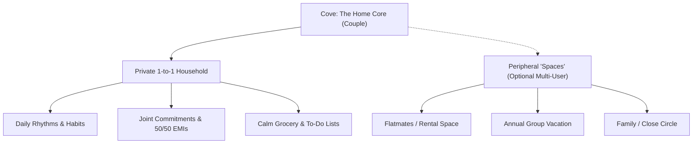

# Strategic Positioning Thesis: Couples vs. Inner Circles & Friend Groups

---

## Executive Summary

**Cove** currently operates as an intimate, end-to-end encrypted operating system designed specifically for two people sharing a life. This document analyzes the strategic trade-offs of remaining exclusively positioned for **Couples (Dyadic Focus)** versus broadening the aperture to **Friend Groups, Roommates & Inner Circles (N-Way Focus)**, or adopting a **Multi-Space Hybrid**.

---

## 1. Comparative Positioning Framework

| Dimension | Pure Couples Positioning ("Cove for Two") | Generic / Friends Positioning ("Cove for Circles") | Phased Dual Positioning ("Cove Spaces") |
| :--- | :--- | :--- | :--- |
| **Headline Tagline** | *"A calm digital home for the two of you."* | *"Calm coordination for the people you live and plan with."* | *"One calm space for your home. Quiet circles for your closest people."* |
| **Target Audience** | Cohabitating couples, newlyweds, engaged partners, long-term duos. | Roommates, close friend groups (trips/housing), core friendship pods. | Couples who also manage a flat, recurring trip, or close friend pod. |
| **Core Emotional Hook** | Intimacy, shared domestic harmony, ending "mental load" resentment. | Frictionless shared living, settling accounts without awkwardness. | Intimate domestic core with flexible peripheral circles. |
| **Primary Competitors** | Paired, Between, Agapé, Cupla, shared Apple Reminders/Notes. | Splitwise, Tricount, Notion, WhatsApp groups, Flatastic. | Splitwise (for expenses) + Notion (for planning) + Paired (for home). |
| **Virality (K-Factor)** | **Bounded ($K \le 1.0$)**: One user invites exactly one partner. | **Unbounded ($K \ge 2.0–4.0$)**: One user invites 3–6 roommates/friends. | **Bridge-based ($1.0 \rightarrow 3.0$)**: Couple adopts first, then creates a circle for a trip or house. |
| **Willingness to Pay (WTP)** | **High ($39–$79/yr per household)**: Valued as a relationship investment. | **Low to Medium ($1.99–$4.99/mo per group)**: High price sensitivity, free-rider problem. | **Very High Tiered**: Free/standard for couple, premium for multiple spaces. |
| **Churn Dynamics** | High retention if both adopt; binary 100% churn if couple breaks up. | High churn post-trip or after lease ends (natural 12-month roommate lifecycle). | Low churn; couple remains the persistent anchor while circles come and go. |

---

## 2. Option A: Pure Couples Positioning ("The Intimate Duo")

### Core Identity & Positioning Statement
> *"Cove is the private, end-to-end encrypted operating system for couples. From grocery runs and monthly commitments to shared rhythms and finances, Cove gives you one calm space to coordinate your life together without the noise of work tools or social feeds."*

### Why This Works (The Bull Case)
1. **Extreme Emotional Pricing Power**:
   - People will pay premium subscription pricing for their romantic relationship and household peace far faster than they will for a group of friends or roommates.
   - Household management is not a utility—it is the #1 driver of domestic tension. Positioning Cove as relationship health infrastructure commands **\$49–\$69/year** household pricing with near-zero price resistance.
2. **Design Purity & UX Simplicity**:
   - The entire UI is built around binary semantics: `You` vs `Partner`, `Mine` vs `Partner` vs `50/50`, `1-tick` (saved locally) to `2-ticks` (synced to partner).
   - No complex permission matrices, no member admin roles, no "who owes whom \$14.20 across 5 people".
3. **Hyper-Defensible Brand Moat**:
   - Big tech (Google, Apple, Notion) builds multi-user productivity tools for enterprise and generic collaboration. They cannot authentically build a "sensual, calm, romantic luxury OS for two."
   - Cove’s Nordic dark/champagne aesthetic, quiet gestures, and calm cadence feel like a bespoke sanctuary. Broadening to friend groups risks making it look like a Slack clone or a dark-mode Splitwise.
4. **Organic Word of Mouth in Tight Demographics**:
   - Couples recommend tools to other couples at dinner parties, weddings, baby showers, and housewarmings.

### Critical Vulnerabilities (The Bear Case)
- **Hard Ceiling on In-App Virality**: Every user brings at most one other user. You must rely purely on word-of-mouth or paid marketing to acquire the next household.
- **Mutual Adoption Hurdle**: If Partner A loves Cove but Partner B is reluctant, the product fails within 7 days.

---

## 3. Option B: Generic Groups & Friends Positioning ("The Private Circle")

### Core Identity & Positioning Statement
> *"Cove is the encrypted shared workspace for your inner circle. Track group expenses, coordinate recurring bills, plan trips, and maintain shared habits with roommates and close friends without spreadsheets or clutter."*

### Why This Works (The Bull Case)
1. **Network Effects & Multiplied Virality ($K > 2.0$)**:
   - When one person introduces Cove to split rent and utilities across a 4-person flat or manage an annual vacation with 6 friends, 5 new users are instantly onboarded.
   - Faster top-of-funnel organic distribution without high customer acquisition cost (CAC).
2. **Total Addressable Market (TAM) Expansion**:
   - Not everyone is in a committed cohabitating relationship, but almost every young adult (18–35) has roommates, travels with friends, or shares recurring subscriptions (Netflix, Spotify, gym).
   - Captures college students, young professionals, and digital nomads.

### Critical Vulnerabilities (The Bear Case)
1. **Feature Bloat & UX Degradation**:
   - Moving from 2 people to $N$ people breaks Cove’s core micro-interactions:
     - The **2-Tick Sync Indicator** no longer means "Delivered to Partner"; it must now indicate who among 5 members received the E2EE ratchet.
     - **Helicopter View & Commitments**: A 50/50 split becomes an $N$-way unequal split ledger, transforming a calm glance into an accounting matrix.
     - **Habits & Cheers**: Cheering a partner’s morning workout feels intimate; cheering 8 friends feels like Strava or a noisy group chat.
2. **The "Splitwise Trap" (Low WTP & High Price Sensitivity)**:
   - Friend groups notoriously refuse to pay for group tools. One person refuses to pay the subscription, breaking the model for the entire group.
   - Roommate groups dissolve every 10–12 months as leases turn over, causing high structural churn.
3. **Loss of Premium Nordic Identity**:
   - Cove loses its quiet luxury status. It becomes an everyday utility competing head-to-head with free giants: Splitwise, WhatsApp Groups, Tricount, Apple Notes, and Notion.

---

## 4. Option C: The Recommended Strategy — "Anchored Dyad with Peripheral Circles"

Rather than abandoning the couple positioning or becoming a generic group utility, the most lucrative and scalable architecture is **Positioning Anchored on Couples, Extensible to Inner Spaces**.

### Strategic Narrative
- **Primary Public Positioning**: **100% Couples First.**
  - All marketing, landing pages, App Store metadata, and branding say: *"The calm shared space for couples."*
  - This preserves the high-WTP emotional hook, the romantic brand equity, and the clean 1-to-1 UX.
- **Product Mechanics**: Multi-Home Architecture (already supported in Cove's database schema).
  - Users can create multiple homes or spaces (e.g. *"Our Apartment"*, *"Goa Trip 2026"*, *"Flat 402"*).
  - Inside a 2-person space, the UI maintains the dedicated **Mine / Partner / 50-50** language.
  - Inside a multi-person space, the UI unlocks multi-party splitting and member avatars.

---

## 5. Decision Matrix & Scorecard

| Evaluation Metric | Weight | Option A: Couples Only | Option B: Friends & Groups | Option C: Couple Core + Spaces |
| :--- | :---: | :---: | :---: | :---: |
| **Willingness to Pay (LTV)** | 25% | **9.5/10** | 4.0/10 | **9.0/10** |
| **Viral Growth Potential (CAC)** | 20% | 5.5/10 | **9.0/10** | 7.5/10 |
| **Brand Differentiation & Defensibility**| 20% | **9.5/10** | 4.5/10 | 8.5/10 |
| **UX Simplicity & Calm Aesthetic** | 20% | **10.0/10** | 4.0/10 | 8.0/10 |
| **Speed to Market / Engineering Scope**| 15% | **10.0/10** | 5.0/10 | 8.5/10 |
| **Weighted Total Score** | 100% | **8.85 / 10** | 5.25 / 10 | **8.35 / 10** |

---

## 6. Strategic Recommendation

1. **Launch Phase (Months 1–6)**: **Own the Couple Niche Exclusively.**
   - Do **not** dilute positioning right now. The couple market has deep emotional pain points, high monetization potential, and zero calm, privacy-first competitors.
   - Double down on copy: *"Our Home"*, *"Mine & Partner"*, *"Helicopter View for Two"*, *"Zero domestic friction"*.
2. **Growth Phase (Months 6–12)**: **Introduce "Cove Spaces" naturally.**
   - Allow existing couple users to spin up a secondary space for a specific use case (e.g. a group trip or shared rental).
   - This unlocks viral $K$-factor expansion **through** your best paying users without muddying the brand identity.
